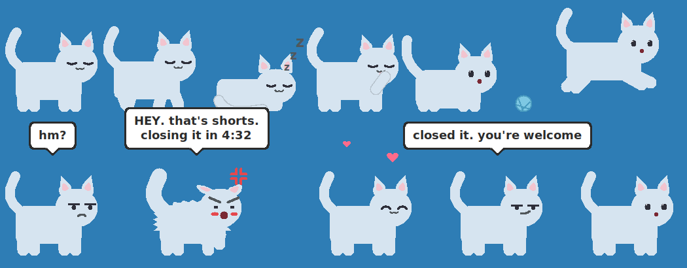

# Focus Cat 🐈

A little minimalist cat that lives on top of your Windows taskbar. It naps, grooms, wanders around, chases a ball of yarn, and purrs when you click it.

But if you open YouTube Shorts (or TikTok, or Reels) and start doomscrolling, it notices. It walks over to wherever your mouse is, puffs up, and yells at you with a countdown. If you're still scrolling five minutes later, it closes the tab.



## How it works

There are two small pieces:

1. **The cat** (`FocusCat.exe`): a transparent, always-on-top window. Clicks go straight through the empty space around it, and clicking the cat itself doesn't steal focus from what you're doing.
2. **The Firefox extension** (`extension/`): every 2 seconds it tells the cat which tab you're looking at, and closes that tab when the cat says so. It only ever talks to `127.0.0.1` on your own PC, so nothing gets sent anywhere.

The timeline when you land on a doomscroll page:

| time on the page | what the cat does |
| --- | --- |
| 0 to 15 s | side-eyes you: "hm?" (this is so one accidental click doesn't set it off) |
| after 15 s | comes over and gets mad, with a 5:00 countdown that gets more dramatic as it goes |
| 5 min later | closes the tab and looks smug about it |

Some details:

- Leave the page and the cat calms down right away and tells you it's proud of you. The countdown only *pauses*, though. You need to stay away for 90 seconds before it fully resets, so quickly flicking to another tab and back won't work.
- If you go right back after it closes a tab, you get 60 seconds, not another five minutes.
- It only counts time when Firefox is the window you're actually using. Shorts open in the background is fine.

## Setup

### 1. Get the cat running

**Easiest option:** download [`FocusCat.exe`](../../releases/latest/download/FocusCat.exe) from the [latest release](../../releases/latest). The extension is there too, as `focus-cat-link.xpi`. Windows will probably say "Windows protected your PC" the first time because the exe isn't code-signed. Click **More info**, then **Run anyway**.

**Or run it from source:** install Python 3.10+ from python.org (keep "tcl/tk" ticked, it is by default), then double-click `FocusCat.pyw`. No other packages are needed.

**Or build the exe yourself:** run `build.bat`. It puts the exe in `dist\FocusCat.exe`.

Once it's running, right-click the cat and tick **Start with Windows** so it's always there.

### 2. Install the Firefox extension

Regular Firefox only keeps extensions installed permanently if Mozilla has signed them. Signing your own copy is free and takes a few minutes:

1. Zip up the *contents* of the `extension` folder (select `manifest.json`, `background.js` and `icon.svg`, then right-click, **Send to**, **Compressed (zipped) folder**). Or use the `.xpi` from the latest release.
2. Go to <https://addons.mozilla.org/developers/addon/submit/distribution>, sign in, and pick **On your own**. This keeps it private; it won't be listed publicly.
3. Upload the zip. Once it passes the automatic checks (usually a few minutes), download the signed `.xpi`.
4. Drag the signed `.xpi` into a Firefox window and click **Add**.

**Just want to try it first?** Open `about:debugging#/runtime/this-firefox`, click **Load Temporary Add-on…** and pick `extension/manifest.json`. This works right away but disappears when Firefox restarts.

To make it work in private windows too, go to `about:addons`, click Focus Cat Link, and set **Run in Private Windows** to Allow.

### 3. Check it's connected

Right-click the cat. The top line should say "Mochi can see Firefox ✓". Then choose **Show me the angry cat (demo)** to watch the angry routine without actually opening Shorts.

## Things you can do with the cat

- **Click it** to pet it (hearts and purring). It won't accept pets while it's mad at you.
- **Drag it** somewhere and let go. It falls back down to the taskbar.
- **Right-click** for the menu:
  - take a 15 min break (it naps and ignores Shorts until the break is over)
  - demo mode
  - start with Windows
  - settings (how the cat looks, plus the doomscroll rules)
  - quit

## Settings

Right-click the cat, then **Settings…**. The window has a live preview of your cat.

- **Look:** pick a quick preset or choose your own fur, inner ear and eye colours, ear shape (pointy, round, folded), eye shape (content, dots, big & shiny), style (minimal or outlined), extras (stripes, blush, whiskers) and size.
- **Doomscroll rules:** the grace period, how long until the tab gets closed, break length, and which sites count.

Everything is saved to `%APPDATA%\FocusCat\config.json`. You can also edit that file directly (restart the cat afterwards). The ones the window doesn't cover:

| setting | default | what it does |
| --- | --- | --- |
| `forgive_after_seconds` | 90 | how long you have to stay away before the countdown resets |
| `second_chance_seconds` | 60 | countdown if you go right back after a close |
| `port` | 47321 | local port. If you change it, also change it in `extension/manifest.json` and `background.js` (needs a restart) |

## Development

```
python -m unittest discover -s tests     # logic + server tests
python -m focuscat --selftest            # opens the cat, runs every animation and the close flow, exits
python tools/render_poses.py out.png     # renders every pose to a PNG (needs Pillow)
```

The code:

- `focuscat/watcher.py` has the doomscroll timing rules and no UI code.
- `focuscat/drawing.py` draws the cat with plain canvas shapes, so there are no image files.
- `focuscat/app.py` has the window, the behaviour, and the mouse handling.
- `focuscat/server.py` is the local endpoint the extension talks to.

Errors get logged to `%APPDATA%\FocusCat\focuscat.log`.
